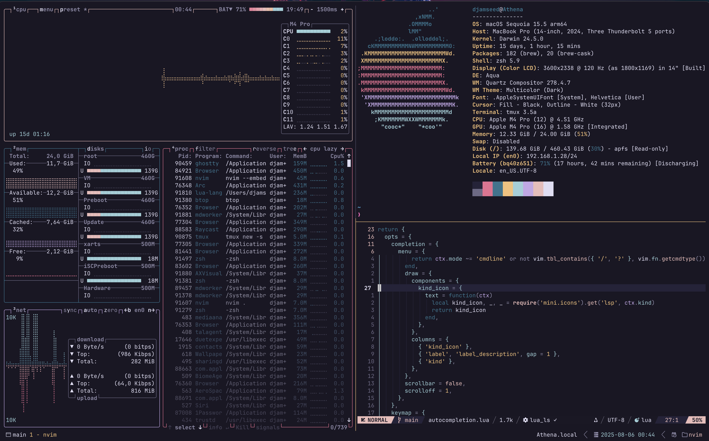

# dotfiles

Setup for my personal dotfiles and [Homebrew](https://brew.sh) packages. Works on \*nix, optimized for macOS.



My setup includes:

-   [Alacritty](https://alacritty.org)
-   [Bash](https://www.gnu.org/software/bash/)
-   [Tmux](https://github.com/tmux/tmux/wiki)
-   [Starship](https://starship.rs/)
-   [Neovim](https://neovim.io/)
-   [Jetbrains Mono Nerd Font](https://www.programmingfonts.org/#jetbrainsmono)

## Install

```sh
bash -c "$(curl -fsSL https://raw.githubusercontent.com/djamseed/dotfiles/main/install.sh)"
```

This will install Homebrew packages and create symlinks from this repo to your home directory.

### Sensible macOS defaults

The install script will also run `macos.sh`, which provide sensible defaults when setting up a new Mac.

## Customizing

Use an `.extra` file to save things (env vars, commands, etc...) you don't want to commit to a public repo.
It will be sourced if present. This can look something like that:

```sh
###
### Git credentials
###

GIT_AUTHOR_NAME="Your Name"
GIT_COMMITTER_NAME="$GIT_AUTHOR_NAME"
git config --global user.name "$GIT_AUTHOR_NAME"

GIT_AUTHOR_EMAIL="email@you.com"
GIT_COMMITTER_EMAIL="$GIT_AUTHOR_EMAIL"
git config --global user.email "$GIT_AUTHOR_EMAIL"

GH_USER="nickname"
git config --global github.user "$GH_USER"
```

## Misc

For my Neovim setup, see [here](https://github.com/djamseed/nvim).
